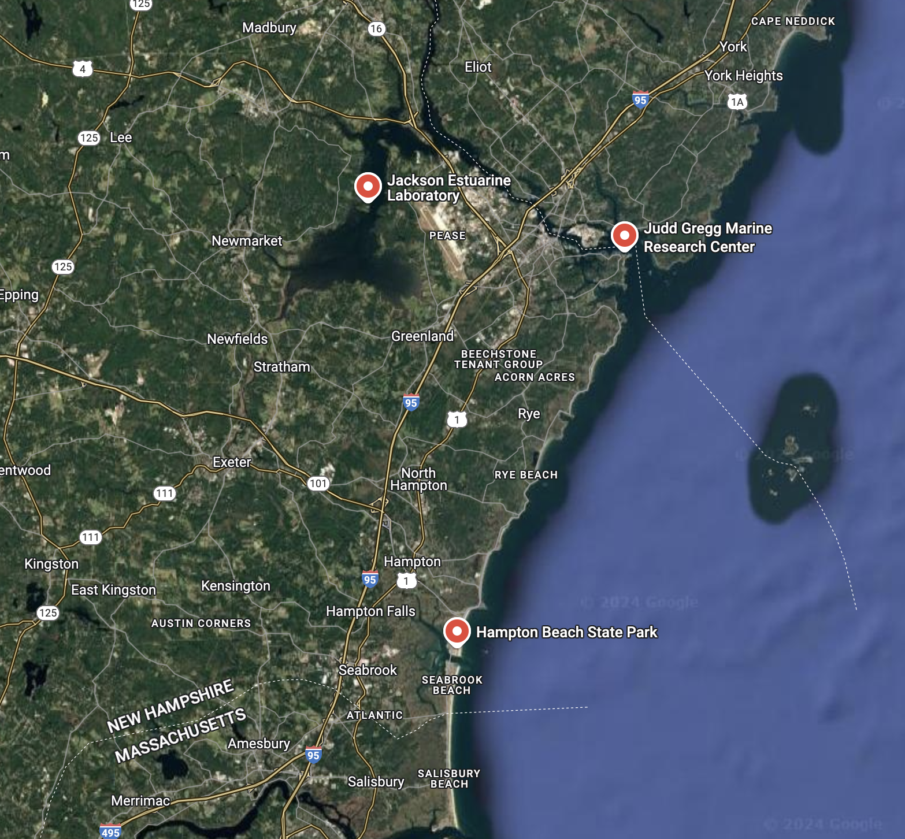
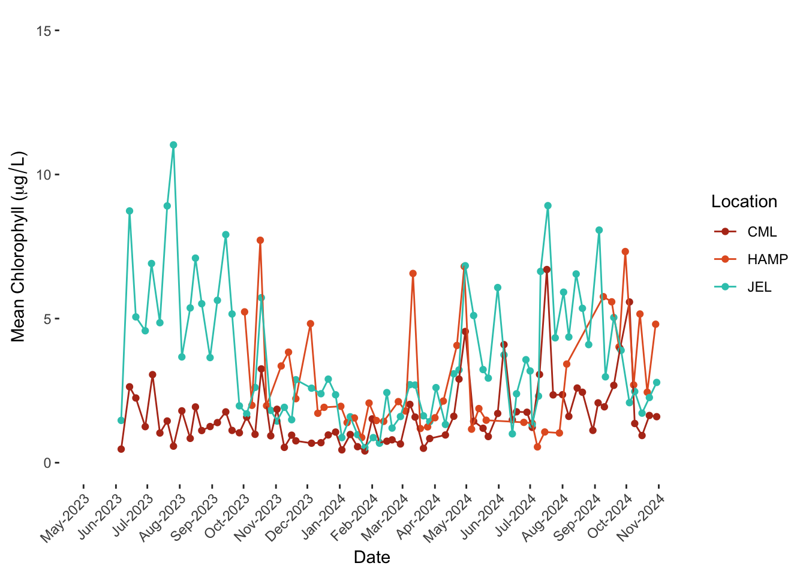
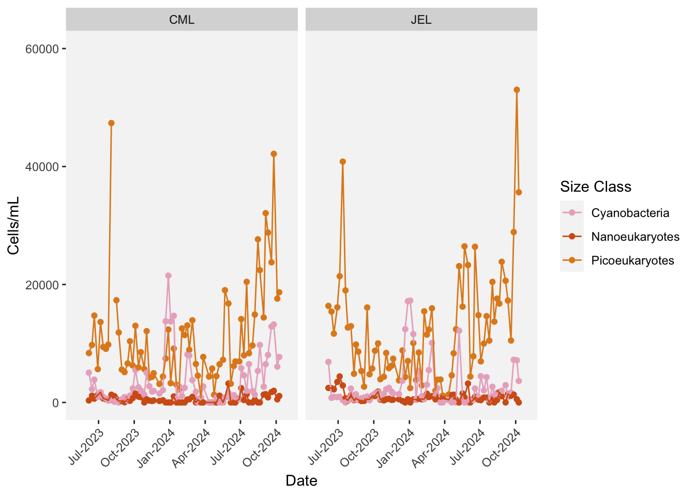
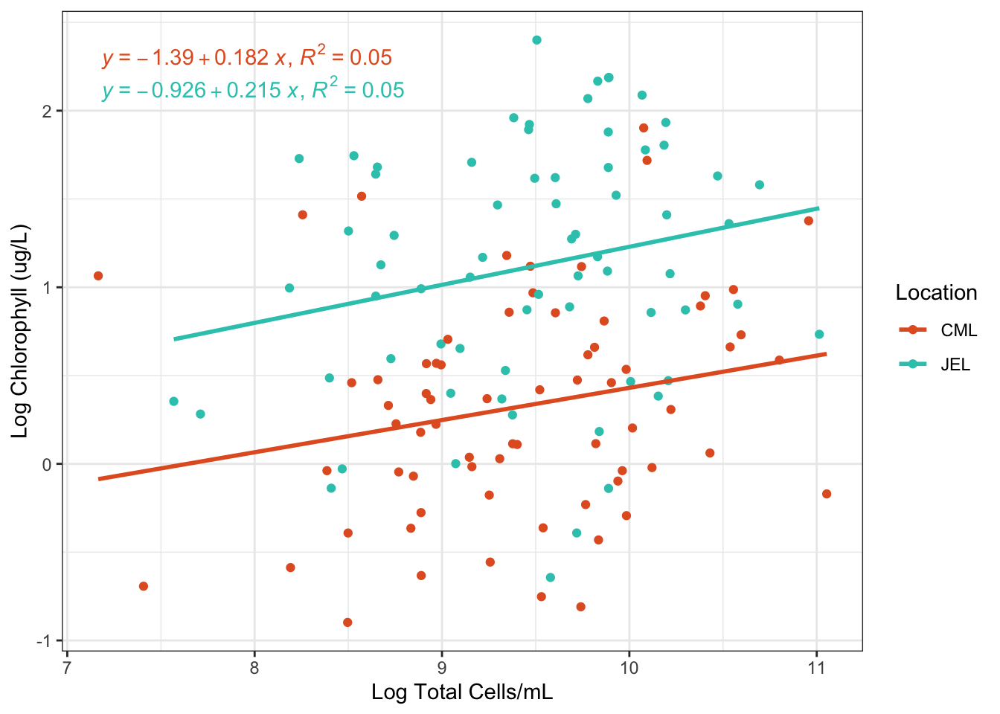
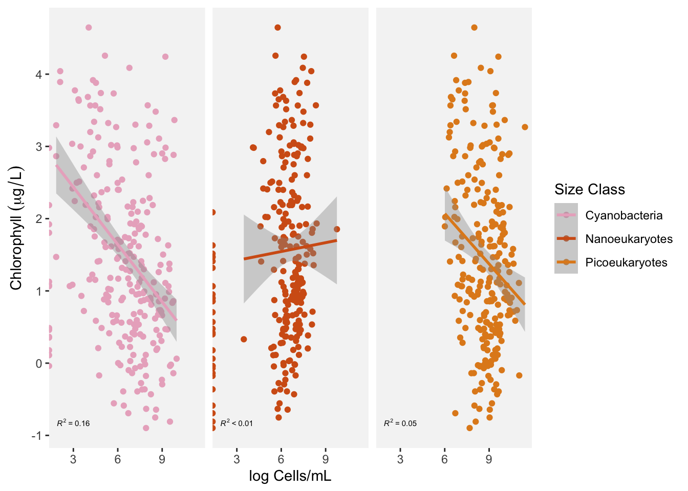
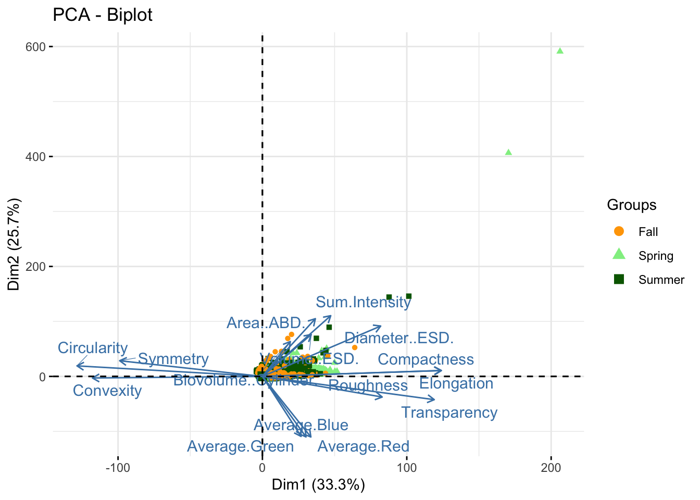
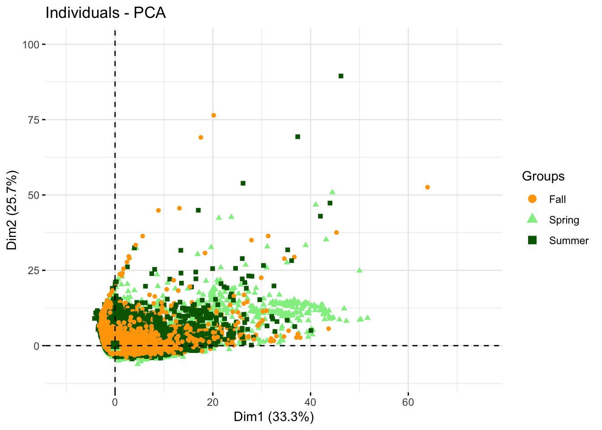
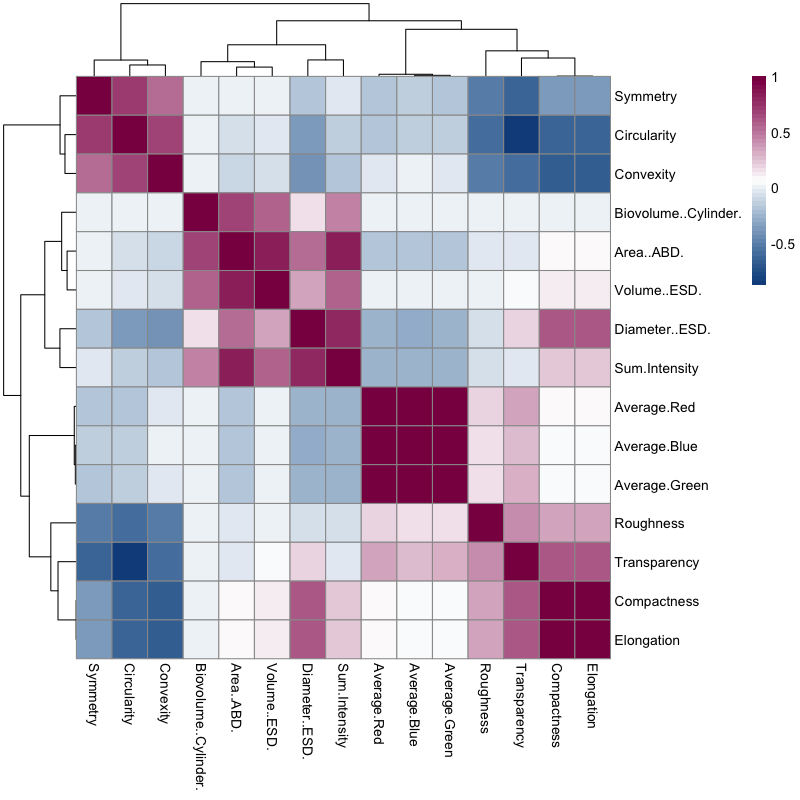
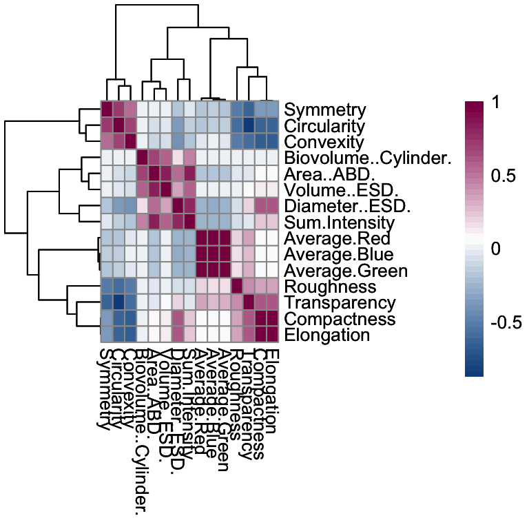

# Introduction

Phytoplankton, as the base of the food chain, are an important but highly variable source of nutrients for filter feeders, including ecologically and commercially valuable bivalves. This variation arises from multiple factors including interspecies differences in nutritional content [@whyte1987; @menden-deuer2000], bivalve feeding strategy (selective vs. generalist) [@shumway1985; @cognie2003; @evanward2004; @beninger2005; @espinosa2010], seasonal and stochastic environmental triggers for phytoplankton germination and reproduction [@glover1985; @thompson1993; @pinckney1997; @kremp2000; @moore2008; @montresor2013], and systemic shifts in environmental parameters due to climate change [@sommer2008; @beardall2009; @winder2012; @barton2016; @henson2021].

While considerable work has been done to map interannual phytoplankton community composition in the Gulf of Maine [@thomas2003; @moore2008; @kane2011; @record2019; @zang2021] , less has been done in New Hampshire’s Great Bay, an area with a growing shellfish aquaculture sector. The Great Bay is a well-mixed estuarine system with multiple riverine inputs. While this system has high connectivity to the Gulf of Maine, as an estuary with multiple riverine inputs, the drivers of phytoplankton community composition in estuaries are markedly different[@pinckney1997; @liu2015; @liu2018] and regional understanding of both seasonal cycles and future predictions is likely not fully accurate.

In order to better understand the local phytoplankton community and therefore their nutritional availability of commercially valuable bivalves, this project utilizes a weekly time series of Flowcam imagery to examine changes in community composition on both an annual and interannual time scale from two locations in the Great Bay estuary. Refinement of this data pipeline will allow us to see in nearly real time what changes are occurring within the local phytoplankton community in order to provide more timely information on harmful algal species and nutritional availability to both managers and shellfish aquaculture stakeholders.

# Methods

Data was collected weekly at multiple sites throughout the Great Bay Estuary and the New Hampshire Seacoast starting in October, 2020. Three sites (@fig-map) were focused on due to their completeness and relevance to understanding the system- Hampton (North Beach, Hampton, NH; 42.90172˚N, 70.809117˚W) University of New Hampshire (UNH) Coastal Marine Lab (CML) (New Castle, NH; 43.091613˚N, 70.710670˚W), and Jackson Estuarine Lab (JEL) (Adam’s Point, Durham, NH; 43.092114˚N, 70.864097˚W). Along with date, tide time was generally recorded. Samples taken at both CML and JEL were taken within thirty minutes before or fifteen minutes after slack high tide.

{#fig-map}

Chlorophyll was measured as in @anderson2018. Briefly, 50-100mL of seawater were passed over 25mm 0.7mm GF/F filters. Filters were then placed in a 91% ethanol solution and left in the dark for 12-24 hours to extract chlorophyll, then samples were measured on a Turner AU10 fluorometer [@jesperson1987; @graff2011]. Samples post-2022 were corrected for phaophytin.

Triplicate 5mL sample aliquots were preserved with 0.5% glutaraldehyde, incubated at 4˚C for 10 minutes, and then stored at -80˚C until analysis (not more than 3 weeks) [@handbook2019]. These samples were then  analyzed for particle size distribution using flow cytometry (Guava easyCyte HT, Millipore), again based on @anderson2018 , at a low flow rate (0.24mL s^-1^) for three minutes to acquire cell counts for picoeukaryotes, nanoeukaryotes, and cyanobacteria. These three groups were identified based on the relationship between forward scatter vs. orange or red florescence signals [@worden2003].

An additional portion of the sample (100-200mL, preserved in 1% formalin) was run through a FlowCam (Model 8100-C, Yokogawa Fluid Imaging technologies, Maine, USA) in order to capture data on the larger cells (20-200mm). Before scanning, samples were filtered through 200mm mesh to remove the particles outside the size-range of interest. Triplicate 5-10mL samples were run on Autoimage mode at 4x magnification through a 300mm flow cell at 2 mL min^-1^. Data was processed using in-built software Visual Spreadsheet 6 to separate out individual particle vignettes and associated data describing size, color, transparency, and symmetry.

All data processing was done using R v. 4.4.0 (R Core Team, 2020). A subset of the time series was selected for analysis based on completeness of data ranging from May 2023 through October 2024. First, the relationship between chlorophyll levels and cell count from both the flow cytometer and the Flowcam were examined visually, considering differences both by location and cell size. Simple linear regressions were built internally to ggplot2 [@ggplot2] using the geom_smooth function, and equations were estimated and printed using ggpmisc \[@ggpmisc\]function stat_poly_eq. Next, a PCA was conducted on the Flowcam data using FactoMineR and factoextra to assess potential groupings and effect sizes of parameters included in the output \[@factoextra; @FactoMineR\]. An exploratory heatmap of parameter correlations was created using package pheatmap [@pheatmap]. Lastly, a generalized linear model was fit to the data to determine which phytoplankton image parameters best track chlorophyll concentration.

# Results


::: {.cell}

```{.r .cell-code .hidden}
## Call required packages
require(dplyr)
```

::: {.cell-output .cell-output-stderr .hidden}

```
Loading required package: dplyr
```


:::

::: {.cell-output .cell-output-stderr .hidden}

```

Attaching package: 'dplyr'
```


:::

::: {.cell-output .cell-output-stderr .hidden}

```
The following objects are masked from 'package:stats':

    filter, lag
```


:::

::: {.cell-output .cell-output-stderr .hidden}

```
The following objects are masked from 'package:base':

    intersect, setdiff, setequal, union
```


:::

```{.r .cell-code .hidden}
library(rprojroot)
require(tidyverse)
```

::: {.cell-output .cell-output-stderr .hidden}

```
Loading required package: tidyverse
```


:::

::: {.cell-output .cell-output-stderr .hidden}

```
── Attaching core tidyverse packages ──────────────────────── tidyverse 2.0.0 ──
✔ forcats   1.0.0     ✔ readr     2.1.5
✔ ggplot2   3.5.1     ✔ stringr   1.5.1
✔ lubridate 1.9.3     ✔ tibble    3.2.1
✔ purrr     1.0.2     ✔ tidyr     1.3.1
── Conflicts ────────────────────────────────────────── tidyverse_conflicts() ──
✖ dplyr::filter() masks stats::filter()
✖ dplyr::lag()    masks stats::lag()
ℹ Use the conflicted package (<http://conflicted.r-lib.org/>) to force all conflicts to become errors
```


:::

```{.r .cell-code .hidden}
require(ggplot2)
require(ggpmisc)
```

::: {.cell-output .cell-output-stderr .hidden}

```
Loading required package: ggpmisc
Loading required package: ggpp
Registered S3 methods overwritten by 'ggpp':
  method                  from   
  heightDetails.titleGrob ggplot2
  widthDetails.titleGrob  ggplot2

Attaching package: 'ggpp'

The following object is masked from 'package:ggplot2':

    annotate
```


:::

```{.r .cell-code .hidden}
require(MetBrewer)
```

::: {.cell-output .cell-output-stderr .hidden}

```
Loading required package: MetBrewer
```


:::

```{.r .cell-code .hidden}
require(stringr)
library(FactoMineR)
library(factoextra)
```

::: {.cell-output .cell-output-stderr .hidden}

```
Welcome! Want to learn more? See two factoextra-related books at https://goo.gl/ve3WBa
```


:::

```{.r .cell-code .hidden}
library(pheatmap)
library(lubridate)
library(lme4)
```

::: {.cell-output .cell-output-stderr .hidden}

```
Loading required package: Matrix

Attaching package: 'Matrix'

The following objects are masked from 'package:tidyr':

    expand, pack, unpack
```


:::

```{.r .cell-code .hidden}
library(broom)
library(knitr)
library(kableExtra)
```

::: {.cell-output .cell-output-stderr .hidden}

```

Attaching package: 'kableExtra'

The following object is masked from 'package:dplyr':

    group_rows
```


:::

```{.r .cell-code .hidden}
library(scales)
```

::: {.cell-output .cell-output-stderr .hidden}

```

Attaching package: 'scales'

The following object is masked from 'package:purrr':

    discard

The following object is masked from 'package:readr':

    col_factor
```


:::

```{.r .cell-code .hidden}
# Load in the data
root_dir<-find_rstudio_root_file()
phyto<-read.csv("notebooks/Weekly NH Coastal Sampling.csv")

# Check data format and structure. Print column names and check the levels of "replicate" for renaming purposes. 

head(phyto)
```

::: {.cell-output .cell-output-stdout .hidden}

```
  Day_Pull Month_Pull Year Tide_Time Location Sample_. Vol_Ex.mL. Vol_Fill.mL.
1        2          1 2024      3:23    HHHR2        2          5          100
2        2          1 2024      3:23    HHHR2        3          5          100
3        3          1 2024     16:19      CML        1          5          100
4        3          1 2024     16:19      CML        2          5          100
5        3          1 2024     16:19      CML        3          5          100
6        3          1 2024     17:58      JEL        1          5          100
      Fo    Fa Chlorophyll..ug.L. Picoeukaryotes..cells.ml.
1 101.10 68.13          1.8935594                      <NA>
2 103.70 68.55          2.0187629                      <NA>
3  27.12 20.04          0.4066242                  3.24E+03
4  28.54 21.04          0.4307460                  1.67E+03
5  30.73 22.06          0.4979424                  4.89E+03
6  58.29 44.43          0.7960186                  5.90E+03
  Nanoeukaryotes..cells.mL. Cyanobacteria..cells.mL. FlowCam Nutrients
1                      <NA>                     <NA>       Y         N
2                      <NA>                     <NA>       Y         N
3                  0.00E+00                 1.14E+04       Y         Y
4                  0.00E+00                 1.67E+04       Y         Y
5                  0.00E+00                 1.31E+04       Y         Y
6                  0.00E+00                 1.18E+04       Y         Y
  Flocytometer DNA.mL. Notes
1            N              
2            N              
3            Y              
4            Y              
5            Y              
6            Y              
```


:::

```{.r .cell-code .hidden}
str(phyto)
```

::: {.cell-output .cell-output-stdout .hidden}

```
'data.frame':	1157 obs. of  19 variables:
 $ Day_Pull                 : int  2 2 3 3 3 3 3 3 8 8 ...
 $ Month_Pull               : int  1 1 1 1 1 1 1 1 1 1 ...
 $ Year                     : int  2024 2024 2024 2024 2024 2024 2024 2024 2024 2024 ...
 $ Tide_Time                : chr  "3:23" "3:23" "16:19" "16:19" ...
 $ Location                 : chr  "HHHR2" "HHHR2" "CML" "CML" ...
 $ Sample_.                 : chr  "2" "3" "1" "2" ...
 $ Vol_Ex.mL.               : int  5 5 5 5 5 5 5 5 5 5 ...
 $ Vol_Fill.mL.             : int  100 100 100 100 100 100 100 100 100 100 ...
 $ Fo                       : num  101.1 103.7 27.1 28.5 30.7 ...
 $ Fa                       : chr  "68.13" "68.55" "20.04" "21.04" ...
 $ Chlorophyll..ug.L.       : num  1.894 2.019 0.407 0.431 0.498 ...
 $ Picoeukaryotes..cells.ml.: chr  NA NA "3.24E+03" "1.67E+03" ...
 $ Nanoeukaryotes..cells.mL.: chr  NA NA "0.00E+00" "0.00E+00" ...
 $ Cyanobacteria..cells.mL. : chr  NA NA "1.14E+04" "1.67E+04" ...
 $ FlowCam                  : chr  "Y" "Y" "Y" "Y" ...
 $ Nutrients                : chr  "N" "N" "Y" "Y" ...
 $ Flocytometer             : chr  "N" "N" "Y" "Y" ...
 $ DNA.mL.                  : chr  "" "" "" "" ...
 $ Notes                    : chr  "" "" "" "" ...
```


:::

```{.r .cell-code .hidden}
colnames(phyto)
```

::: {.cell-output .cell-output-stdout .hidden}

```
 [1] "Day_Pull"                  "Month_Pull"               
 [3] "Year"                      "Tide_Time"                
 [5] "Location"                  "Sample_."                 
 [7] "Vol_Ex.mL."                "Vol_Fill.mL."             
 [9] "Fo"                        "Fa"                       
[11] "Chlorophyll..ug.L."        "Picoeukaryotes..cells.ml."
[13] "Nanoeukaryotes..cells.mL." "Cyanobacteria..cells.mL." 
[15] "FlowCam"                   "Nutrients"                
[17] "Flocytometer"              "DNA.mL."                  
[19] "Notes"                    
```


:::

```{.r .cell-code .hidden}
levels(as.factor(phyto[,6]))
```

::: {.cell-output .cell-output-stdout .hidden}

```
 [1] ""                                     
 [2] "1"                                    
 [3] "2"                                    
 [4] "3"                                    
 [5] "A"                                    
 [6] "B"                                    
 [7] "C"                                    
 [8] "NO SAMPLE THIS WEEK, LAB CONSTRUCTION"
 [9] "T01001"                               
[10] "T01002"                               
[11] "T01003"                               
```


:::

```{.r .cell-code .hidden}
# Coerces the year, month, and day columns into a single date column. Drops columns that are not useful. Relevels the "replicate" data so triplicates are 1, 2, and 3. Filters by location so that only CML, JEL, and Hampton are pulled, then regroups several of the Hampton nomenclatures so it appears as 3 factor levels. Coerce columns that should be numeric into numeric. Reformats "tide time" into a four digit value format HH:MM so it can be coerced into time object. Drops unused levels. 

phyto_clean<-phyto %>% 
  mutate(date=make_date(year=Year, month=Month_Pull, day=Day_Pull)) %>% 
  dplyr::select(date, Tide_Time, Location, Sample_., Chlorophyll..ug.L.,Picoeukaryotes..cells.ml.,
                Nanoeukaryotes..cells.mL., Cyanobacteria..cells.mL.) %>% 
  `colnames<-`(c("date", "tide_time", "location","replicate","chl","picoeuk","nanoeuk","cyanobac")) %>% 
  filter(replicate %in% c("1","2","3","A","B","C")) %>% 
  mutate(replicate=fct_recode(replicate, "1"="1","2"="2","3"="3", "1"="A", "2"="B","3"="C")) %>% 
  filter(as.factor(location) %in% c('CML', 'HAMP',"Hampton","HHHR2","JEL")) %>% 
  mutate(location=fct_recode(location, "CML"="CML","HAMP"="HAMP","HAMP"="Hampton","HAMP"="HHHR2", "JEL"="JEL")) %>% 
  mutate(across(c(5:8), as.numeric)) %>% 
  mutate(tide_time = if_else(tide_time == "", NA_character_,
    str_pad(as.character(tide_time), width = 5, side = "left", pad = "0")  # Pad non-blank values
  )) %>% 
  droplevels()
```
:::


While the general trend in chlorophyll across the three sites showed considerable variation, there did seem to be broad seasonal trends apparent (@fig-chl). There is higher overall chlorophyll present in Summer 2023 which decreases over the fall, except for a small fall bloom in October, in to the winter with a low in January 2024, before starting to rise into the spring bloom in April 2024. There is a brief drop in productivity after the bloom before chlorophyll levels increase into the summer months. The clearest trend is visible at JEL, an estuarine site. Overall, chlorophyll seems to be lower at CML on the coast than the other two sites. HAMP generally follows trends, but appears to have higher spring and fall blooms with slightly more moderate chlorophyll values relative to the season mean throughout the year.


::: {#cell-fig-chl .cell messages='false' warnings='false'}

```{.r .cell-code .hidden}
# Creates a summary table to the chlorophyll measurements grouped by data and location
chl_summary<-phyto_clean %>% 
  dplyr::select(date, tide_time, location, replicate, chl) %>% 
  group_by(date, location) %>% 
  summarize(count=n(),mean_chl=mean(chl))
```

::: {.cell-output .cell-output-stderr .hidden}

```
`summarise()` has grouped output by 'date'. You can override using the
`.groups` argument.
```


:::

```{.r .cell-code .hidden}
#Plot of all chlorophyll data from the three sites of interest
chl_plot_short<-ggplot(data=chl_summary, mapping=aes(x=as.Date(date), y=mean_chl, color=location))+
  geom_point()+
  geom_line()+
  scale_color_manual(values=met.brewer("Peru1",3, type="discrete"))+
  labs(x="Date",y = expression("Mean Chlorophyll ("*mu*g/L*")"), color="Location")+
  scale_x_date(date_breaks="1 month",
               labels=date_format("%b-%Y"),
               limits=as.Date(c("2023-05-05", "2024-10-30")))+
  scale_y_continuous(limits=c(0,15))+
  theme(axis.text.x=element_text(angle=45, vjust=1, hjust=1),
        panel.background = element_blank(),
        panel.grid = element_blank())
chl_plot_short
```

::: {.cell-output .cell-output-stderr .hidden}

```
Warning: Removed 139 rows containing missing values or values outside the scale range
(`geom_point()`).
```


:::

::: {.cell-output .cell-output-stderr .hidden}

```
Warning: Removed 139 rows containing missing values or values outside the scale range
(`geom_line()`).
```


:::

::: {.cell-output-display}
{#fig-chl fig-alt='A plot of the concentration of chlorophyll ($\mu$g/L) corrected for phaeophytin at Hampton Beach (HAMP), the Coastal Marine Lab (CML), and Jackson Estuarine Lab (JEL) showing seasonal trends across approximately a year and a half' width=672}
:::
:::


The distribution of cell counts separated into cyanobacteria, nanoeukaryotes, and picoeukaryotes at both CML and JEL follow similar trends over the time span (@fig-small-cells). At both sites, nanoeukaryotes had the lowest overall cell count throughout the data series with less of a seasonal trend than either of the other classes. Cyanobacteria has a moderate cell concentration year-round relative to the other two groups, with a peak in January 2024 at both sites and some evidence on increasing concentration in fall. Picoeukaryotes seem to follow a similar trend to chlorophyll concentrations with higher concentrations during summer and less in winter, although there is a sharp decrease in this size class at both locations roughly lining up with the spring bloom into summer productivity (March-June). This would suggest a lag behind total chlorophyll trends for this group.


::: {#cell-fig-small-cells .cell}

```{.r .cell-code .hidden}
# Summary table of the small cell sizes (picoeukaryote, nanoeukaryote, cyanobacteria) and associated chlorophyll measurement grouped by date and location

cellcount<-phyto_clean %>% 
  group_by(date, location) %>% 
  filter(!is.na(picoeuk)) %>% 
  summarize(count=n(), mean_chl=mean(chl), mean_pico=mean(picoeuk), mean_nano=mean(nanoeuk),
            mean_cyano=mean(cyanobac), tot_cell=(mean_pico + mean_nano + mean_cyano) )
```

::: {.cell-output .cell-output-stderr .hidden}

```
`summarise()` has grouped output by 'date'. You can override using the
`.groups` argument.
```


:::

```{.r .cell-code .hidden}
# Pivot to long format for easier graphing
cell_long<-cellcount %>% 
  pivot_longer(names_to="Phyto_Size", values_to="Cells_mL", cols=-(c(date, location,count, mean_chl)))


cell_plot_short<-ggplot(data = cell_long %>% filter(Phyto_Size != "tot_cell" & location !="HAMP"), mapping=aes(x=date, y=Cells_mL,color=Phyto_Size))+
  facet_wrap(~location)+
  geom_point()+
  geom_line()+
  scale_color_manual(values=met.brewer("Tara",3, type="discrete"), labels=c("Cyanobacteria","Nanoeukaryotes","Picoeukaryotes"))+
  scale_x_date(date_breaks="3 month",
               labels=date_format("%b-%Y"),
               limits=as.Date(c("2023-05-05", "2024-10-30")))+
  scale_y_continuous(limits=c(0,60000))+
  theme(axis.text.x=element_text(angle=45, vjust=1, hjust=1),
        panel.grid = element_blank(), 
        panel.background=element_rect(fill="grey96"))+
  labs(x="Date",y = "Cells/mL", color="Size Class")
cell_plot_short  
```

::: {.cell-output .cell-output-stderr .hidden}

```
Warning: Removed 205 rows containing missing values or values outside the scale range
(`geom_point()`).
```


:::

::: {.cell-output .cell-output-stderr .hidden}

```
Warning: Removed 147 rows containing missing values or values outside the scale range
(`geom_line()`).
```


:::

::: {.cell-output-display}
{#fig-small-cells fig-alt='A scatterplot with lines colored by size class displaying changes in cell concentration from June 2023 to November 2024.' width=672}
:::
:::


When we map total cell counts onto chlorophyll concentrations, no apparent trend emerges (@fig-chl-to-cell-location). Linear regressions, even on log-log transformed data, can only account for an extremely small amount of the variation, even when separated by location ($\text{R}^2$=0.05 for both CML and JEL). Grouping the data by cell size (@fig-chl-to-cell-group) also reveals little to no correlation (Cyanobacteria $\text{R}^2$=0.16, nanoeukaryote $\text{R}^2$=\<0.01, picoeukaryote $\text{R}^2$=0.05). It should be noted here that this group of cells are the smallest sizes of phytoplankton.


::: {#cell-fig-chl-to-cell-location .cell messages='false' warnings='false'}

```{.r .cell-code .hidden}
#Plotting total cell count to chlorophyll relationship  by location 
chl_all_cell<-cellcount %>% 
  filter(date>"2023-05-05") %>% 
  ggplot(mapping=aes(x=log(tot_cell), y=log(mean_chl), color=location))+
  geom_point()+
  geom_smooth(method="lm", se=F)+
  stat_poly_eq(use_label(c("eq", "R2")))+
  labs(x="Log Total Cells/mL", y="Log Chlorophyll (ug/L)", color="Location")+
  scale_color_manual(values=met.brewer("Peru1",2, type="discrete"))+
  theme_bw()
chl_all_cell
```

::: {.cell-output .cell-output-stderr .hidden}

```
`geom_smooth()` using formula = 'y ~ x'
```


:::

::: {.cell-output-display}
{#fig-chl-to-cell-location fig-alt='Text goes here' width=672}
:::
:::

::: {#cell-fig-chl-to-cell-group .cell messages='false' warnings='false'}

```{.r .cell-code .hidden}
#Plotting chlorophyll to cell relationship faceted by phytoplankton size class
chl_to_cell <- cell_long %>% 
  filter(date > "2023-05-05") %>% 
  ggplot(data = cell_long %>% filter(Phyto_Size != "tot_cell"), 
         mapping = aes(x = log(Cells_mL), y = log(mean_chl), color = Phyto_Size)) +
  geom_point() +
  geom_smooth(method = "lm") +
  stat_poly_eq(color="black", label.x="left", label.y = "bottom", size=2 )+
  facet_wrap(~Phyto_Size) +
  scale_color_manual(values = met.brewer("Tara", 3, type = "discrete"), 
                     labels = c("Cyanobacteria", "Nanoeukaryotes", "Picoeukaryotes")) +
  labs(x = "log Cells/mL", y = expression("Chlorophyll " (mu * g/L)), color = "Size Class") +
  theme(panel.grid = element_blank(),
        panel.background = element_rect(fill = "grey96"),
        strip.text = element_blank())
chl_to_cell
```

::: {.cell-output .cell-output-stderr .hidden}

```
`geom_smooth()` using formula = 'y ~ x'
```


:::

::: {.cell-output .cell-output-stderr .hidden}

```
Warning: Removed 58 rows containing non-finite outside the scale range
(`stat_smooth()`).
```


:::

::: {.cell-output .cell-output-stderr .hidden}

```
Warning: Removed 58 rows containing non-finite outside the scale range
(`stat_poly_eq()`).
```


:::

::: {.cell-output .cell-output-stderr .hidden}

```
Warning: Removed 12 rows containing missing values or values outside the scale range
(`geom_point()`).
```


:::

::: {.cell-output-display}
{#fig-chl-to-cell-group fig-alt='Text goes here' width=672}
:::
:::

::: {.cell messages='false' warnings='false'}

```{.r .cell-code .hidden}
# Read in the data
flowcam<-read.csv("notebooks/flowcam_combined_output.csv")
str(flowcam)
```

::: {.cell-output .cell-output-stdout .hidden}

```
'data.frame':	524761 obs. of  74 variables:
 $ Name                   : chr  "Harvey_11April2024_CML_4x" "Harvey_11April2024_CML_4x" "Harvey_11April2024_CML_4x" "Harvey_11April2024_CML_4x" ...
 $ Area..ABD.             : num  215.6 420.1 87.2 40.7 208.9 ...
 $ Area..Filled.          : num  215.6 420.1 87.2 40.7 211.1 ...
 $ Aspect.Ratio           : num  0.649 0.604 0.573 0.633 0.551 ...
 $ Average.Blue           : num  177 170 184 170 174 ...
 $ Average.Green          : num  176 169 183 169 169 ...
 $ Average.Red            : num  173 167 182 168 165 ...
 $ Biovolume..Cylinder.   : num  7747 14281 2606 677 6783 ...
 $ Biovolume..P..Spheroid.: num  1775 4419 434 555 1447 ...
 $ Biovolume..Sphere.     : num  2381 6478 613 195 2271 ...
 $ Calibration.Factor     : num  1.82 1.82 1.82 1.82 1.82 ...
 $ Calibration.Image      : int  0 0 0 0 0 0 0 0 0 0 ...
 $ Capture.ID             : int  1 2 3 4 5 6 7 8 9 10 ...
 $ Capture.X              : int  368 598 589 724 283 447 199 506 459 781 ...
 $ Capture.Y              : int  1341 148 1094 1330 988 615 1534 1323 1240 154 ...
 $ Ch1.Area               : int  0 0 0 0 0 0 0 0 0 0 ...
 $ Ch1.Peak               : int  0 0 0 0 0 0 0 0 0 0 ...
 $ Ch1.Width              : int  0 0 0 0 0 0 0 0 0 0 ...
 $ Ch2.Area               : int  0 0 0 0 0 0 0 0 0 0 ...
 $ Ch2.Peak               : int  0 0 0 0 0 0 0 0 0 0 ...
 $ Ch2.Width              : int  0 0 0 0 0 0 0 0 0 0 ...
 $ Ch2.Ch1.Ratio          : int  0 0 0 0 0 0 0 0 0 0 ...
 $ Circle.Fit             : num  0.75 0.713 0.763 0.667 0.664 ...
 $ Circularity            : num  0.782 0.876 0.974 0.394 0.76 ...
 $ Circularity..Hu.       : num  0.881 0.882 0.865 0.472 0.814 ...
 $ Compactness            : num  1.28 1.14 1.03 2.54 1.32 ...
 $ Convex.Perimeter       : num  73.7 93 50.2 50.8 73.8 ...
 $ Convexity              : num  1 1 1 0.742 1 ...
 $ Date                   : chr  "05-16-2024 16:13:41" "05-16-2024 16:13:41" "05-16-2024 16:13:41" "05-16-2024 16:13:41" ...
 $ Diameter..ABD.         : num  16.6 23.1 10.5 7.2 16.3 ...
 $ Diameter..ESD.         : num  19.7 26 12.2 12.5 19.7 ...
 $ Diameter..FD.          : num  16.6 23.1 10.5 7.2 16.4 ...
 $ Edge.Gradient          : num  154.1 56.5 178.7 107.2 161.9 ...
 $ Elapsed.Time           : num  0.859 1.141 1.219 1.297 1.297 ...
 $ Elongation             : num  1.15 1 1 5.81 1.44 ...
 $ Feret.Angle.Max        : int  35 -85 -70 50 -35 -85 -40 -90 -70 20 ...
 $ Feret.Angle.Min        : int  -40 10 0 -55 65 0 25 0 0 -90 ...
 $ Fiber.Curl             : num  0 0 0 0.985 0 ...
 $ Fiber.Straightness     : num  1.123 1.282 1.161 0.504 1.011 ...
 $ Filter.Score           : num  0 0 0 0 0 0 0 0 0 0 ...
 $ Geodesic.Aspect.Ratio  : num  0.869 1 1 0.172 0.695 ...
 $ Geodesic.Length        : num  23.5 26.3 14.9 30.8 26.2 ...
 $ Geodesic.Thickness     : num  20.47 26.3 14.92 5.29 18.17 ...
 $ Group.ID               : int  1 2 3 4 5 6 7 8 9 10 ...
 $ Image.Height           : int  25 32 23 21 22 33 23 34 21 21 ...
 $ Image.Width            : int  25 25 18 21 28 22 23 23 21 25 ...
 $ Image.X                : int  0 0 0 0 0 0 0 0 0 0 ...
 $ Image.Y                : int  0 0 0 0 0 0 0 0 0 0 ...
 $ Intensity              : num  103 130 109 134 106 ...
 $ Length                 : num  26.4 33.7 17.3 15.5 26.4 ...
 $ Particles.Per.Chain    : int  1 1 1 1 1 1 1 1 1 1 ...
 $ Perimeter              : num  88 105.2 59.7 72.1 88.6 ...
 $ Ratio.Blue.Green       : num  1.01 1.01 1 1.01 1.03 ...
 $ Ratio.Red.Blue         : num  0.976 0.986 0.99 0.983 0.949 ...
 $ Ratio.Red.Green        : num  0.986 0.993 0.995 0.992 0.974 ...
 $ Roughness              : num  1.19 1.13 1.19 1.42 1.2 ...
 $ Scatter.Area           : int  0 0 0 0 0 0 0 0 0 0 ...
 $ Scatter.Peak           : int  0 0 0 0 0 0 0 0 0 0 ...
 $ Scatter.Width          : int  0 0 0 0 0 0 0 0 0 0 ...
 $ Sigma.Intensity        : num  32.3 21 31.2 13.1 32.2 ...
 $ Source.Image           : int  9971504 9971505 9971506 9971507 9971507 9971508 9971509 9971509 9971509 9971509 ...
 $ Sphere.Complement      : int  0 0 0 0 0 0 0 0 0 0 ...
 $ Sphere.Count           : int  0 0 0 0 0 0 0 0 0 0 ...
 $ Sphere.Unknown         : int  0 0 0 0 0 0 0 0 0 0 ...
 $ Sphere.Volume          : int  0 0 0 0 0 0 0 0 0 0 ...
 $ Sum.Intensity          : int  14913 30112 9076 6562 15116 26215 13338 19257 13440 18253 ...
 $ Symmetry               : num  0.803 0.8 0.836 0.279 0.527 ...
 $ Time                   : chr  "05-16-2024 16:13:41" "05-16-2024 16:13:41" "05-16-2024 16:13:41" "05-16-2024 16:13:41" ...
 $ Timestamp              : chr  "05-16-2024 16:13:41" "05-16-2024 16:13:41" "05-16-2024 16:13:41" "05-16-2024 16:13:41" ...
 $ Transparency           : num  0.159 0.11 0.137 0.422 0.172 ...
 $ UUID                   : chr  "DD31663913C011EF8CA10030180A94F9" "DD316A9213C011EF8CA10030180A94F9" "DD316D9113C011EF8CA10030180A94F9" "DD31705F13C011EF8CA10030180A94F9" ...
 $ Volume..ABD.           : num  2381 6478 613 195 2271 ...
 $ Volume..ESD.           : num  4002 9179 952 1012 4002 ...
 $ Width                  : num  11.85 17.32 7.29 8.2 11.85 ...
```


:::

```{.r .cell-code .hidden}
#In the original data, some particles are missing an underscore after "Harvey" which makes the separate function not work correctly. This adds in that missing underscore if it is not present and ensures the name matches the set pattern to metadata can be extracted.

flowcam <- flowcam %>%
  mutate(Name = ifelse(str_detect(Name, "^Harvey[^_].*$"),#
                       str_replace(Name, "^Harvey", "Harvey_"),
                       Name)) %>% 
  mutate(Name = str_replace(Name, "^CML_20July2023_4x$", "20July2023_CML_4x")) %>% 
  mutate(Name = ifelse(str_detect(Name, "^Harvey_"), 
                              Name, 
                              paste0("Harvey_", Name)))

# Data clean step. Seperate the Name column reformated by underscore to create separate columns for for name, date, location, and magnification. Select metadata columns and subset useful numeric columns. Reformatting date column so that it can be coerced into date object. Creating a new column called "Season". 


flowcam_clean<- flowcam %>% 
  tidyr::separate(col=Name,into=c("Name","Date","Location","Mag"), extra="drop", remove=FALSE) %>% 
  dplyr::select(Date, Location, Mag, Capture.ID, Average.Blue, Average.Green, Average.Red, Biovolume..Cylinder., Area..ABD.,Circularity, Compactness, Convexity, Diameter..ESD.,Elongation, Roughness, Sum.Intensity, Symmetry, Transparency, Volume..ESD.) %>% 
  mutate(Date = gsub("Sept", "September", Date),  # Replace "Sept" with "September"
    Date = as.Date(Date, format="%d%B%Y")) %>% 
  mutate(Identifier=paste(Date, Location, sep="_")) %>% 
  mutate(
    Month = month(Date),  # Extract month from the date
    Season = case_when(
      Month %in% c(3, 4, 5) ~ "Spring",  # March, April, May
      Month %in% c(6, 7, 8) ~ "Summer",  # June, July, August
      Month %in% c(9, 10, 11) ~ "Fall",  # September, October, November
      TRUE ~ "Winter"  # December, January, February
    ), as.factor(Season)) %>% 
  mutate(across(2:4, as.factor)) 
```
:::


To look at the larger size phytoplankton, data from the Flowcam was analyzed. Because there are so many numeric parameters generated by the Flowcam, a Principle Component Analysis (PCA) was run to look at the relative contributions of each parameter to the data distribution (@fig-biplot).


::: {#cell-fig-biplot .cell messages='false' warnings='false'}

```{.r .cell-code .hidden}
# Minor reformatting for PCA. Dropping some columns and making sure structure is correct
flowcam_smaller<-flowcam_clean %>% 
  dplyr::select(Identifier, Season, Date, Location, Average.Blue:Volume..ESD.) %>% 
  mutate(across(Identifier:Location, as.factor))

# Running a PCA while retaining relevant qualitative variables (factors in cols 1:4)
morpho_pca <- FactoMineR::PCA(flowcam_smaller, quali.sup = 1:4,
                              graph = FALSE)

# Biplot of PCA, PC1 vs PC2
fviz_pca_biplot(morpho_pca, label="var", habillage=flowcam_smaller$Season, repel=T, 
                palette=c("orange","lightgreen","darkgreen"))
```

::: {.cell-output-display}
{#fig-biplot fig-alt='This is a biplot which maps all of the points colored by season with blue arrows representing the eigenvalues of each parameter. This biplot is for PC1 and PC2' width=672}
:::
:::

::: {.cell}

```{.r .cell-code .hidden}
# Create eig_table
eig_table <- as.data.frame(morpho_pca$eig)
```
:::

::: {.cell messages='false' warnings='false' caption='Eigenvalues from the PCA' alt='This is a table with output from a PCA which includes eigenvalues, percentage of variance, and cumulative percentage of variance.'}

```{.r .cell-code .hidden}
library(knitr)

# Create table with caption
cute_table <- eig_table %>%
  kable(digits = 4, 
        col.names = c("Eigenvalue", "Percentage of Variance", "Cumulative Percentage of Variance"), 
        caption= "Table 1: Eigenvalues from PCA")  # 

cute_table
```

::: {.cell-output-display}


Table: Table 1: Eigenvalues from PCA

|        | Eigenvalue| Percentage of Variance| Cumulative Percentage of Variance|
|:-------|----------:|----------------------:|---------------------------------:|
|comp 1  |     4.9941|                33.2941|                           33.2941|
|comp 2  |     3.8592|                25.7283|                           59.0224|
|comp 3  |     2.4863|                16.5756|                           75.5980|
|comp 4  |     1.1836|                 7.8908|                           83.4888|
|comp 5  |     0.6621|                 4.4137|                           87.9025|
|comp 6  |     0.5589|                 3.7263|                           91.6288|
|comp 7  |     0.4223|                 2.8152|                           94.4440|
|comp 8  |     0.3214|                 2.1424|                           96.5865|
|comp 9  |     0.3070|                 2.0468|                           98.6333|
|comp 10 |     0.0955|                 0.6367|                           99.2700|
|comp 11 |     0.0587|                 0.3915|                           99.6615|
|comp 12 |     0.0385|                 0.2566|                           99.9181|
|comp 13 |     0.0102|                 0.0679|                           99.9860|
|comp 14 |     0.0018|                 0.0119|                           99.9979|
|comp 15 |     0.0003|                 0.0021|                          100.0000|


:::
:::


There were four significant components (eigenvalue \> 1) (Table 1) with PC1 accounting for 33.294% of variation and PC2 accounting for 25.728% of the data. PC3 accounts for another 16.576%, and PC4 7.891%. Circularity, convexity, compactness, elongation, and transparency contributed significantly to PC1, and average blue, green, and red along with area, diameter, and sum intensity were encapsulated in PC2.


::: {#cell-fig-pca-ind .cell messages='false' warnings='false'}

```{.r .cell-code .hidden}
# Plot of individual points only with reduced axis limits to look at trends
fviz_pca_ind(morpho_pca, label="none", habillage=flowcam_smaller$Season, 
             palette=c("orange","lightgreen","darkgreen"), xlim=c(-10,75), ylim=c(-10,100))
```

::: {.cell-output-display}
{#fig-pca-ind fig-alt='This is only the' width=672}
:::
:::


Looking at the individual points from the PCA plot colored by season (@fig-pca-ind), it seems apparent that there is a core group of individuals with common optical characteristics that are present regardless of the season. While there may be some shift in community characteristics, especially during the spring, many of the points not within the main "group" appear to be outliers.

While the PCA was informative for looking at contributions, it was also necessary to look for relationships between parameters in order to reduce correlation in the model (@fig-heatmap). Symmetry, circularity, and convexity are tightly correlated, as are biovolume, area, volume, and diameter. Average red, blue, and green also group, as do compactness and elongation. These groups are highly unsurprising as the methods used to calculate values within groups are derived from the same values.


::: {#cell-fig-heatmap .cell messages='false' warnings='false'}

```{.r .cell-code .hidden}
#Looking more concretely at how we can group variables. 

numeric_data <- flowcam_clean %>% 
  dplyr::select(Average.Blue, Average.Green, Average.Red, Biovolume..Cylinder., Area..ABD., 
         Circularity, Compactness, Convexity, Diameter..ESD., Elongation, Roughness, 
         Sum.Intensity, Symmetry, Transparency, Volume..ESD.)

# Scale the numeric data
scaled_data <- scale(numeric_data)

# Calculate the correlation matrix
corr_matrix <- cor(scaled_data)

# Plot the heatmap and save as png so latex doesn't explode

#png("images/heatmap_output.png", width=800, height=800, res=100)
heatmap<-pheatmap(corr_matrix, 
         cluster_rows = TRUE, 
         cluster_cols = TRUE, 
         display_numbers = F, 
         color = colorRampPalette(c("dodgerblue4", "white", "deeppink4"))(50))
heatmap
#dev.off()

# Include the saved PNG as an image
#knitr:: 


# Symmetry, circularity, and convexity group
# Biovol, Area, Volume, Diameter Group
# Average red, blue, and green group
# Compactness and elongation group
```

::: {.cell-output-display}
{#fig-heatmap fig-alt='A heatmap showing correlation values between Flowcam parameters with positive values displaying as more pink, zero centered around white, and negative values dark blue. Parameters are grouped by corrlation with trees showing branch of colinearity along the left and top of the plot.' width=384}
:::
:::

::: {.cell messages='false' warnings='false'}

```{.r .cell-code .hidden}
# The samples were not necessary scanned the same day they were taken. Eventually I will hopefully have the origin date incorporated from other metadata, but for now I am going to match by week, year, and location. Sorry this is hella bootstrapped. 

# Step 1: Extract Week and Year from Date columns in both datasets
flowcam_clean <- flowcam_clean %>%
  mutate(Week = week(Date), Year = year(Date))

chl_summary <- chl_summary %>%
  mutate(Week = week(date), Year = year(date))

# Step 2: Left join based on Week, Year, and Location
flowcam_with_chl <- left_join(flowcam_clean, chl_summary, by = c("Week", "Year", "Location"="location"))
summary(flowcam_with_chl)
```

::: {.cell-output .cell-output-stdout .hidden}

```
      Date            Location      Mag           Capture.ID    
 Min.   :2023-06-06   CML : 76097   4x:489394   2      :   106  
 1st Qu.:2023-07-05   JEL :448664   4X: 35367   3      :   106  
 Median :2023-08-31   HAMP:     0               4      :   106  
 Mean   :2023-11-01                             5      :   106  
 3rd Qu.:2024-04-21                             6      :   106  
 Max.   :2024-05-08                             7      :   106  
                                                (Other):524125  
  Average.Blue    Average.Green     Average.Red     Biovolume..Cylinder.
 Min.   : 11.79   Min.   : 11.94   Min.   : 12.04   Min.   :6.000e+01   
 1st Qu.:162.26   1st Qu.:160.54   1st Qu.:158.63   1st Qu.:3.180e+03   
 Median :168.18   Median :166.66   Median :164.87   Median :4.789e+03   
 Mean   :167.50   Mean   :165.98   Mean   :164.21   Mean   :1.244e+04   
 3rd Qu.:173.82   3rd Qu.:172.58   3rd Qu.:171.07   3rd Qu.:8.807e+03   
 Max.   :212.14   Max.   :212.24   Max.   :213.26   Max.   :1.498e+09   
                                                                        
   Area..ABD.        Circularity      Compactness       Convexity     
 Min.   :    12.5   Min.   :0.0173   Min.   : 1.000   Min.   :0.0000  
 1st Qu.:   108.3   1st Qu.:0.6576   1st Qu.: 1.083   1st Qu.:1.0000  
 Median :   167.6   Median :0.8143   Median : 1.228   Median :1.0000  
 Mean   :   300.2   Mean   :0.7708   Mean   : 1.466   Mean   :0.9752  
 3rd Qu.:   309.5   3rd Qu.:0.9236   3rd Qu.: 1.521   3rd Qu.:1.0000  
 Max.   :619355.0   Max.   :1.0000   Max.   :57.848   Max.   :1.0000  
                                                                      
 Diameter..ESD.      Elongation        Roughness      Sum.Intensity    
 Min.   :  12.00   Min.   :  1.000   Min.   :0.4086   Min.   :    740  
 1st Qu.:  14.28   1st Qu.:  1.000   1st Qu.:1.1642   1st Qu.:  11290  
 Median :  17.72   Median :  1.000   Median :1.1929   Median :  14598  
 Mean   :  21.52   Mean   :  2.157   Mean   :1.2096   Mean   :  18703  
 3rd Qu.:  24.00   3rd Qu.:  2.352   3rd Qu.:1.2321   3rd Qu.:  21022  
 Max.   :1644.50   Max.   :179.728   Max.   :3.5972   Max.   :6287378  
                                                                       
    Symmetry       Transparency     Volume..ESD.        Identifier       
 Min.   :0.0000   Min.   :0.0054   Min.   :9.050e+02   Length:524761     
 1st Qu.:0.5640   1st Qu.:0.1037   1st Qu.:1.525e+03   Class :character  
 Median :0.7141   Median :0.1556   Median :2.915e+03   Mode  :character  
 Mean   :0.6727   Mean   :0.1824   Mean   :4.211e+04                     
 3rd Qu.:0.8181   3rd Qu.:0.2296   3rd Qu.:7.241e+03                     
 Max.   :1.0000   Max.   :0.9289   Max.   :2.329e+09                     
                                                                         
     Month           Season          as.factor(Season)      Week      
 Min.   : 4.000   Length:524761      Fall  : 89808     Min.   :15.00  
 1st Qu.: 5.000   Class :character   Spring:171525     1st Qu.:19.00  
 Median : 7.000   Mode  :character   Summer:263428     Median :27.00  
 Mean   : 6.623                                        Mean   :26.96  
 3rd Qu.: 8.000                                        3rd Qu.:32.00  
 Max.   :11.000                                        Max.   :47.00  
                                                                      
      Year           date                count      mean_chl     
 Min.   :2023   Min.   :2023-06-06   Min.   :3   Min.   :0.4713  
 1st Qu.:2023   1st Qu.:2023-07-05   1st Qu.:3   1st Qu.:2.6113  
 Median :2023   Median :2023-08-30   Median :3   Median :5.1058  
 Mean   :2023   Mean   :2023-11-01   Mean   :3   Mean   :4.8375  
 3rd Qu.:2024   3rd Qu.:2024-04-19   3rd Qu.:3   3rd Qu.:6.9111  
 Max.   :2024   Max.   :2024-05-08   Max.   :3   Max.   :8.9097  
                                                                 
```


:::

```{.r .cell-code .hidden}
head(flowcam_with_chl)
```

::: {.cell-output .cell-output-stdout .hidden}

```
        Date Location Mag Capture.ID Average.Blue Average.Green Average.Red
1 2024-04-11      CML  4x          1     177.4138      175.5034    173.0690
2 2024-04-11      CML  4x          2     169.8276      168.5690    167.4612
3 2024-04-11      CML  4x          3     183.6145      182.7349    181.7831
4 2024-04-11      CML  4x          4     170.4286      168.8367    167.5510
5 2024-04-11      CML  4x          5     173.8099      169.4859    165.0211
6 2024-04-11      CML  4x          6     175.8994      174.7654    173.8212
  Biovolume..Cylinder. Area..ABD. Circularity Compactness Convexity
1            7746.7994   215.5513      0.7816      1.2795    1.0000
2           14281.1482   420.1248      0.8757      1.1419    1.0000
3            2606.3048    87.2012      0.9738      1.0269    1.0000
4             677.0406    40.7108      0.3935      2.5411    0.7424
5            6782.8726   208.9005      0.7599      1.3159    1.0000
6            9104.4015   293.0915      0.7471      1.3385    1.0000
  Diameter..ESD. Elongation Roughness Sum.Intensity Symmetry Transparency
1        19.6985     1.1502    1.1938         14913   0.8030       0.1590
2        25.9778     1.0000    1.1305         30112   0.8000       0.1097
3        12.2040     1.0000    1.1881          9076   0.8356       0.1366
4        12.4572     5.8111    1.4202          6562   0.2794       0.4220
5        19.6985     1.4391    1.2016         15116   0.5275       0.1721
6        24.4079     1.5666    1.1326         26215   0.5548       0.2085
  Volume..ESD.     Identifier Month Season as.factor(Season) Week Year
1    4002.2105 2024-04-11_CML     4 Spring            Spring   15 2024
2    9179.1659 2024-04-11_CML     4 Spring            Spring   15 2024
3     951.7048 2024-04-11_CML     4 Spring            Spring   15 2024
4    1012.1770 2024-04-11_CML     4 Spring            Spring   15 2024
5    4002.2105 2024-04-11_CML     4 Spring            Spring   15 2024
6    7613.6383 2024-04-11_CML     4 Spring            Spring   15 2024
        date count  mean_chl
1 2024-04-11     3 0.9621908
2 2024-04-11     3 0.9621908
3 2024-04-11     3 0.9621908
4 2024-04-11     3 0.9621908
5 2024-04-11     3 0.9621908
6 2024-04-11     3 0.9621908
```


:::

```{.r .cell-code .hidden}
#hist(log(chl_summary$mean_chl)+1) # shit is not normal at all
#hist(chl_summary$mean_chl)
#hist(flowcam_with_chl$mean_chl)

#flowcam_with_chl$mean_chl_log <- log(flowcam_with_chl$mean_chl + 1)


# The distribution of this data is exponential, so a negative binomial might be a good fit.
# Because the chl values I have are bulk values for each date, I think I also need a random effect component on "Identifier" (factor that aligns with chl)  because I am essentially sampling from that value multiple times 
# I have chosen my variables based on the PCA and the heatmap: Circularity, Average.Red, Transparency, and Diameter..ESD.

#str(flowcam_with_chl)
#flowcam_with_chl$Identifier<-as.factor(flowcam_with_chl$Identifier)
#library(glmmTMB)
#mod1_gamma <- glmer(mean_chl ~ Volume..ESD. + Average.Red + Circularity + (1 |Identifier),
#                         data = flowcam_with_chl)
#summary(mod1_gamma)
# This is being an absolute nightmare and crashing R studio every time I try to run, so I'm simplifying for this assignment. Any tips on how to get it to NOT have convergence issues and crash my computer would be amazing (:                             
                          
# Tidy and summarize the data so it is grouped by identifier (date_location)
flowcam_chl_small<-flowcam_with_chl %>% 
  group_by(Identifier, Season, Location) %>% 
  select(mean_chl, Diameter..ESD., Average.Red, Circularity, Transparency) %>% 
  summarize(chl=mean(mean_chl), diameter=mean(Diameter..ESD.), avg_red=mean(Average.Red), 
            circularity=mean(Circularity), transparency=mean(Transparency)) %>% 
  mutate(log_chl=(log(chl)+1))
```

::: {.cell-output .cell-output-stderr .hidden}

```
Adding missing grouping variables: `Identifier`, `Season`, `Location`
`summarise()` has grouped output by 'Identifier', 'Season'. You can override
using the `.groups` argument.
```


:::

```{.r .cell-code .hidden}
#Checking distribution of chl. It is still not normal with a log transformation, but the non-transformed looked like a good contender for a Gamma distribution with a log link. 
#hist(flowcam_chl_small$chl)
#hist(flowcam_chl_small$log_chl)

# First model-  Gamma GLM with log link using numeric parameters identified from PCA/heatmap plus location and season
small_mod<-glm(chl ~ diameter + avg_red + circularity + transparency + Location + Season, data=flowcam_chl_small, family=Gamma(link="log"))
#summary(small_mod)

# Second model- Dropping numeric parameters except for diameter because nothing is significant once averaged (cool??? also wtf??)
small_mod2<-glm(chl ~ Location + Season + diameter, data=flowcam_chl_small, family=Gamma(link="log"))
#Looking at model output
mod_sum<-summary(small_mod2)

#Checking residuals
#plot(small_mod2)

#Comparing AIC values
AIC<-AIC(small_mod, small_mod2)
```
:::


Building off of the correlation analysis and the vector lengths from the PCA, a generalited linear model with a Gamma distribution and log link was fit for average chlorophyll as a function of average red, circularity, diameter (equivalent spherical), location, and season. The numeric parameters were averaged over location and date in order to simplify the model. The model was further reduced to eliminate non-significant coefficients for an final fit of chlorphyll as a function of diameter, season, and location (Table 2) (AIC=119.89). The chlorophyll at JEL is on average 1.468 ± 0.24 $\mu$g/L (p= \<0.0001) higher than at CML. Spring chlorophyll concentrations are estimated to be 1.069 ± 0.25$\mu$g/L (p= 0.00015) higher than fall, and summer chlorophyll 0.687 ± 0.22$\mu$g/L (p=0.00354). Diameter is estimated to increase by 0.202 ± 0.07$\mu$m (p= 0.00698) for every $\mu$g/L increase in chlorophyll.


::: {.cell messages='false' warnings='false'}

```{.r .cell-code .hidden}
# Creating a tidy table of output
mod_table <- tidy(small_mod2) %>%
  mutate(RowLabel = c("Intercept", "Jackson Estuarine Lab", "Spring", "Summer", "Diameter (ESD)"),
         p_value_formatted = case_when(
           p.value < 0.0001 ~ "<0.0001***",
           p.value < 0.001  ~ paste0(sprintf("%.5f", p.value), "***"),
           p.value < 0.01   ~ paste0(sprintf("%.5f", p.value), "**"),
           p.value < 0.05   ~ paste0(sprintf("%.5f", p.value), "*"),
           TRUE             ~ sprintf("%.5f", p.value)
         )) %>%
  select(RowLabel, estimate, std.error, statistic, p_value_formatted) %>% 
  kable(col.names = c("Term", "Estimate", "Standard Error", "t-Value", "p-Value"),
    caption = "Table 2: Model summary for mean chlorophyll as a function of location, season, and diameter", digits=c(1, 3, 3, 3, 4))
mod_table
```

::: {.cell-output-display}


Table: Table 2: Model summary for mean chlorophyll as a function of location, season, and diameter

|Term                  | Estimate| Standard Error| t-Value|p-Value    |
|:---------------------|--------:|--------------:|-------:|:----------|
|Intercept             |   -4.901|          1.741|  -2.816|0.00838**  |
|Jackson Estuarine Lab |    1.468|          0.245|   6.004|<0.0001*** |
|Spring                |    1.069|          0.248|   4.307|0.00015*** |
|Summer                |    0.687|          0.217|   3.157|0.00354**  |
|Diameter (ESD)        |    0.202|          0.070|   2.889|0.00698**  |


:::
:::


# Discussion

Additionally, @fig-chl makes a compelling argument for considering local chlorophyll concentrations within the Great Bay estuary rather than relying on an average. The highly-estuarine site JEL frequently shows elevated chlorophyll concentrations relative to coastal-adjacent CML, with differences as high a factor of magnitude. CML is also interesting in that its bloom peaks seem to be on average lower than either HAMP or JEL. HAMP also exhibits a fair amount of variability, but its high-est annual concentrations in the available data seem to be the fall blooms in both 2023 and 2024. Fall tends to be a smaller, secondary bloom which is triggered by the increased mix depth due to the breaking up of water column stratification at the end of summer, rather than the spring bloom which is triggered by light and temperature. It would be helpful to examine environmental parameters from these three locations to get a better sense of what physical factors might be driving these changes. It would also be interesting to collect finer resolution chlorophyll concentration data on either a daily-tidal or even hourly timescale.

Another important consideration with the chlorophyll data is that not all of the bulk chlorophyll measured may be coming from a living source. It is possible that the chlorophyll is associated with dead primary producers in detritus which have not broken down enough yet to change the detectable composition of chlorophyll. Future plans for this dataset include adding identification to all particles which will allow us to filter out any non-living individuals from analysis.

For the smaller size classes of phytoplankton, all three size classes also showed high rates of variability on a weekly time scale. Picoeukaryotes had on average the highest overall concentration over the course of the year with peaks in summer and fall, perhaps slightly lagged behind the main chlorophyll peak. Cyanobacteria had their highest relative concentration peak in the middle of winter, perhaps due to some alleviation of competition during the winter lull in overall productivity. Nanoeukaryotes had relatively low concentration compared to the other two groups, but this may be partially due to a sampling artifact as they tend to fall on the lower end of detection size-wise. While these comparisons may be interesting, there was unfortunately no correlation between the small cells and chlorophyll either broken down by location ($\text{R}^2$ = 0.05 for both) or by size class ($\text{R}^2$ = 0.16, \<0.01, and 0.05 for cyanobacteria, nanoeukaryotes, and picoeukaryotes, respectively). This shows that any signal due to the smaller cells is likely being swamped by blooms of larger individuals like diatoms. Again, future identification of particles and cross-reference between Flowcam and flow cytometer data will better elucidate this relationship.

The preliminary analysis of parameter relationships was fairly unsurprising, with lots of correlations signifying it will likely be easy to reduce the amount of variables necessary for an effective model. Similar parameters tended to be calculated with some unifying calculation (e.g., color, describing circle-based measurements, measures of area/diameter). The most interesting part of the PCA actually turned out to be the pattern of the individual data points and how they group on PC1 vs. PC2 (@fig-pca-ind). It appears as though there is a core grouping around the (0,0) which does not change seasonally. This again may be due to characteristics of detritus in the water rather than living phytoplankton, so this figure will be interesting to revisit after creating a classification filter. There does visually appear to be differences between seasons which may intensify after removing detritus.

Due to complications with the model, the data was simplified by averaging characteristics and modeled as mean bulk chlorophyll as a function of location, season, and diameter. Model fitting procedure showed that when averaged, mean diameter was the only imaging parameter (from the reduced subset chosen to test) that had any significance. This could possibly be due to that core grouping of individuals around the origin in the individual PCA plot; the weight of the core “blob” could be outweighing outliers (potentially the larger, living phytoplankton). The fact that season and location were significant factors was unsurprising judging by the visual assessment of data distribution. It will be extremely interesting to see what happens with a more complex model, hopefully one with a random effect for date-location and better accounting for multiple-sampling.

# Conclusion

This preliminary exploration of phytoplankton community composition data in the Great Bay shows several important things to consider in future analysis. First, small size phytoplankton, while ecologically interesting, do not contribute significantly to bulk chlorophyll measurements, meaning that they can be ignored in models for now. Second, there appears to be a core grouping of particle images from the Flowcam which, when averaged, swamp statistical differences in imaging parameters from “outliers”. If this group is indeed detrital, classification and filtering of these particles is essential for better modeling the relationship between particle images and chlorophyll. Overall, this analysis emphasizes the need for classification in high throughput imaging studies in order to handle non-target particles.

# Works Cited

